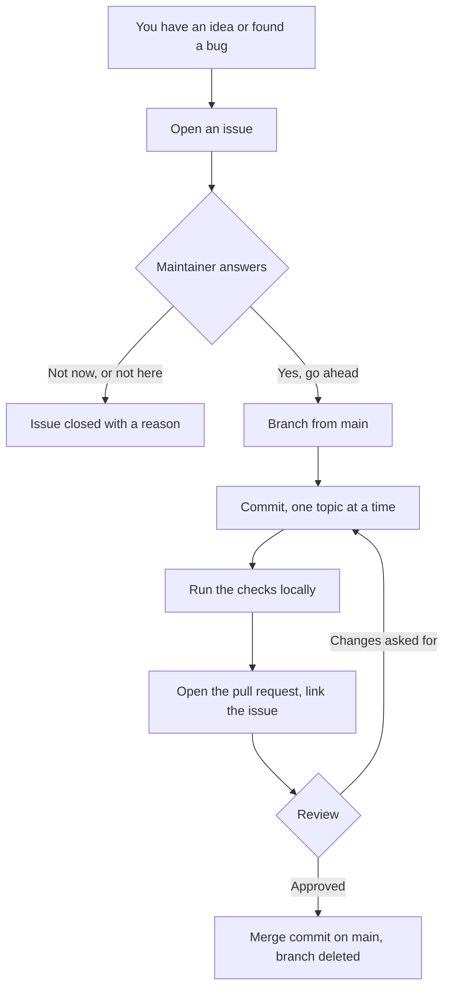

# Mitarbeit an AbGal

*[In English](CONTRIBUTING.md)*

AbGal wird von einer Person gepflegt. Diese eine Tatsache erklärt jede Regel
unten. Es gibt kein Team, das eine Überraschung auffängt, keinen Reviewer in
Bereitschaft und kein Budget, um eine Änderung zu entwirren, die ohne Vorwarnung
kam. Die Regeln sind da, damit deine Zeit nicht verschwendet wird. Mehr kann ein
kleines Projekt einem Mitwirkenden nicht ehrlich versprechen.

Lies das, bevor du Code schreibst. Es ist kürzer als der Code.

## Die eine Regel vor allen anderen

**Erst ein Issue öffnen. Dann einen Pull Request schicken.**

Ein Pull Request ohne Issue wird geschlossen, höflich, von einem Workflow, mit
einem Link zurück auf diese Datei. Das ist keine Unhöflichkeit und hat nichts mit
der Qualität deiner Arbeit zu tun. Es geht um die Reihenfolge des Gesprächs: über
eine Änderung, der niemand zugestimmt hat, wird erst gestritten, wenn sie schon
geschrieben ist, und bis dahin hat jemand einen Abend daran gesessen.



Die Antwort auf ein Issue kann Nein sein. Ein Nein kommt innerhalb von Tagen und
kostet dich nichts. Ein Nein auf einen fertigen Pull Request kommt, nachdem du
die Sache gebaut hast, und genau das soll diese Regel verhindern.

Issues sind der einzige Kanal. Discussions sind absichtlich abgeschaltet, denn ein
Kanal, den niemand liest, ist schlechter als gar keiner.

## Was ein Issue brauchbar macht

Schreib, was du beobachtet hast, was du erwartet hast und was du ausgeführt
hast. Bei einem Fehler sind die Version des Werkzeugs und die Ausgabe mehr wert
als ein Adjektiv:

```
abgal status
python3 --version
uname -srm
```

Bei einem Wunsch schreib, was du erreichen willst, nicht welche Funktion dazu
kommen soll. Das Problem hinter dem Wunsch lässt sich oft anders lösen, als du
es im Kopf hattest, und manchmal schon heute.

Füge nichts Privates ein. Protokollzeilen aus einem echten Lauf können einen
Rechnernamen, einen Benutzerpfad, eine Seriennummer oder eine Adresse enthalten.
Lies, was du einfügst, bevor du es abschickst, denn ein Issue ist öffentlich,
sobald es existiert.

## Branches

Zweige von `main` ab. Benenne den Branch nach dem, was er tut, auf Englisch, in
Kleinbuchstaben, Wörter mit genau einem Bindestrich verbunden: `contribution-rules`,
`golden-image`, `setup-command`.

**Ein Branch trägt zwischen 300 und 1000 geänderte Zeilen.**

Die Obergrenze ist die wichtige. Ab etwa tausend Zeilen hört ein Review auf, ein
Review zu sein, und wird zum Abnicken, weil niemand so viel fremden Code auf
einmal im Kopf behalten kann. Ist deine Änderung wirklich größer, dann sind es
wirklich mehrere Änderungen, und sie bekommen mehrere Issues und mehrere
Branches.

Die Untergrenze ist eine Gewohnheit, kein Gesetz. Es gibt sie, weil ein Branch
mit vierzig Zeilen meist heißt, dass die Arbeit drumherum jemand anderem
überlassen wurde. **Schreib nie Text oder Code, den du nicht brauchst, nur um sie
zu erreichen.** Eine Änderung, die bei zweihundert Zeilen fertig ist, ist fertig.
Einen Branch auf eine Zahl aufzublähen ist schlimmer, als die Zahl zu verfehlen,
und im Review wird danach gefragt.

## Commits

**Ein Thema je Commit.** Ein Commit, der eine Datei umbenennt und zugleich einen
Fehler behebt, lässt sich nicht zurücknehmen, ohne eines von beiden zu verlieren.

Die Betreffzeile ist `type(scope): subject`, und der Scope fehlt nie:

```
docs(contributing): write down the rules for issues and branches
fix(start): keep the previous emulator log
feat(cli): accept more than one guest name per start
```

Der Typ ist einer von `feat`, `fix`, `docs`, `ci`, `refactor`, `test`, `chore`.

Nach dem Betreff kommt eine Leerzeile und dann eine Aufzählung, was sich geändert
hat und, wo es nicht offensichtlich ist, warum. Kein Absatz Fließtext. Wer in
einem Jahr `git log` liest, will die Fakten in einer Form, die sich überfliegen
lässt.

**Nach Dateinamen stagen.** Schreib die Pfade aus, die du meinst:

```
git add CONTRIBUTING.md
```

Nicht `git add -A`, nicht `git add .`. Genau so landen eine Sicherungsdatei des
Editors, eine lokale Einstellung oder ein verirrtes Protokoll in einem
öffentlichen Repository. Der Datenschutzwächter fängt davon viel, aber keine
Datei, deren Inhalt nur peinlich ist und nicht privat.

Lieber mehrere kleine Commits als einen großen. Ein Reviewer, der deinen
Schritten folgen kann, kann sie freigeben. Einem einzigen Commit mit
siebenhundert Zeilen kann er nur vertrauen oder ihn ablehnen.

## Testen vor dem Commit

**Führ die Sache so aus, wie ein Benutzer sie ausführt, nicht so, wie du sie
geschrieben hast.**

Diese Regel hat das Projekt am meisten gekostet und am meisten gelehrt. Eine
Änderung, die über einen zweiten Einstieg bewiesen wurde, ein Hilfsskript, eine
kopierte Befehlszeile, eine direkt aufgerufene Funktion, ist gar nicht bewiesen.
Nur der Weg, den das Werkzeug wirklich nimmt, zählt.

> Eine Änderung gilt als fertig, wenn der Weg getestet ist, den die Benutzung
> wirklich nimmt. Ein zweiter Einstieg ist eine stille Lüge.

Konkret: wer `abgal start` anfasst, startet `abgal start` gegen ein echtes
Android Virtual Device (AVD) und sieht zu, wie es hochkommt. Wer die
Temperaturwache anfasst, senkt `ABGAL_TEMP_STOP` unter die aktuelle Temperatur
und sieht zu, wie sie ein AVD stoppt. Schreib in den Pull Request, was du
ausgeführt hast und was zurückkam.

### Wohin ein Test gehört

| Ordner | Für einen Test, der | Läuft |
|---|---|---|
| `tests/unit/` | eine Funktion aufruft, ohne Prozess, ohne Netz und ohne adb | bei jedem Push und Pull Request |
| `tests/integration/` | mehrere Teile zusammensetzt, einen echten Subprozess oder einen echten HTTP-Server, mit den Fakes aus `tests/fakes/` statt adb und `/proc` | bei jedem Push und Pull Request |
| `tests/e2e/` | ein echtes AVD, KVM und das SDK braucht. Ein Lauf mit mehreren AVDs über lange Zeit bekommt zusätzlich `@pytest.mark.load` | nur mit `ABGAL_E2E=1` |

`pytest` führt alle drei aus und überspringt `e2e` und `load`, solange
`ABGAL_E2E=1` nicht gesetzt ist, und ist damit auf jedem Rechner gefahrlos.
`tests/fakes/` enthält `FakeAdb` und `FakeProc`, die Fixtures `fake_adb` und
`fake_proc` in `tests/conftest.py` setzen sie ein. Ein Test, der das echte
adb oder einen echten Emulatorprozess braucht, gehört nach `e2e/`.

## Alles auf GitHub Sichtbare ist zuerst Englisch

Code, Kommentare, Dateinamen, Variablennamen, Branchnamen, Commit Betreffzeilen,
Titel und Text von Pull Requests, Titel von Issues, Namen von Labels. Alles
Englisch.

Eine Seite der Dokumentation darf zusätzlich einen deutschen Spiegel haben,
`X.de.md` neben `X.md`. Die englische Seite entsteht zuerst und ist die, die
gilt. Eine deutsche Seite steht nie allein, eine Änderung an einer Seite geht
im selben Pull Request auch in die andere, und jedes Paar verweist in den
ersten Zeilen auf die andere Sprache. `.gitignore` ignoriert jede andere
`*.de.md`, und `tools/check-private.py` weist Umlaute außerhalb eines
gelisteten Spiegels ab, ein neuer Spiegel braucht also in beiden seine eigene
Ausnahme.

Das ist keine Stilfrage. Die Hälfte der lokalen Notizen dieses Projekts ist
deutsch, und die Grenze zwischen dem, was lokal bleibt, und dem, was öffentlich
wird, muss eine Linie sein, die man prüfen kann, keine Abwägung, die jemand
müde treffen muss. Die Linie lautet: was GitHub anzeigen kann, ist Englisch,
oder es ist der `.de.md` Spiegel einer englischen Seite, für die das gilt.

## Nie etwas Privates

Das Repository hat einen Wächter:

```
python3 tools/check-private.py            # what a commit would record
python3 tools/check-private.py --all      # every tracked file
python3 tools/check-private.py --tree     # every file on disk
```

Er liest, was git gleich festhalten wird, und nicht, was zufällig im
Arbeitsverzeichnis liegt, denn nur Ersteres erreicht je ein Remote. Er meldet,
wie oft ein Muster traf und in welcher Datei, aber nie den getroffenen Wert,
damit seine eigene Ausgabe gefahrlos in ein Issue passt.

**Einmal nach dem Klonen einschalten:**

```
git config core.hooksPath .githooks
```

Dieser eine Befehl lässt den Wächter vor jedem Commit laufen. Er ist nicht von
selbst an, weil git einem Repository nicht erlaubt, seine eigenen Hooks zu
aktivieren, und das aus gutem Grund. Bis du ihn ausführst, prüft dich nichts.

Rückgabewert 0 heißt sauber, und nichts anderes ist ein Bestehen. Ein Fund endet
mit 1, ein Lauf, der nicht prüfen konnte, mit 2. Meldet der Wächter etwas in
einer Datei, die du hinzufügst, umgeh ihn nicht. Entweder gehört die Datei nicht
ins Repository, oder die Musterliste braucht eine echte Diskussion in einem
Issue.

Muster, die eine Form beschreiben, eine Adresse, eine Rufnummer, eine private
IP, stehen im Skript und dürfen veröffentlicht werden. Wörtliche Begriffe, die
nie auftauchen dürfen, stehen in `.private-words`, das nicht verfolgt wird.
Kopiere `.private-words.example` und trag deine eigenen ein.

## Kommentare im Code

Willkommen, wo sie gebraucht werden, und sonst nicht. Höchstens zwei bis drei
Sätze.

Ein Kommentar verdient seinen Platz, wenn er sagt **warum**, vor allem dort, wo
der Code falsch aussieht und es nicht ist. Ein Kommentar, der die Zeile darüber
wiederholt, ist Rauschen, das gepflegt werden muss. Die Begründung eines
Entwurfs gehört in das Issue, aus dem er entstand, wo sie vollständig lesbar ist.

## Diagramme in der Dokumentation

Wo ein Dokument einen Ablauf, einen Zustand oder eine Entscheidung beschreibt,
zeichne ihn als Mermaid Block statt ihn in Prosa zu beschreiben. GitHub zeigt
Mermaid ohne Bilddatei an, das Diagramm bleibt also in der Diff des Pull
Requests und lässt sich wie Text prüfen.

Ein Ablauf, der auf Warten, Abfragen oder mehr als einem Akteur zur selben
Zeit beruht, ist die Ausnahme, und ebenso ein Diagramm, das eine Seite mit
einem solchen teilt: dasselbe erzeugte Aussehen für jedes Diagramm einer
Seite, auch für ein statisches ohne Bewegung, hält die Seite einheitlich,
statt mitten im Dokument den Stil zu wechseln. In beiden Fällen wird die SVG
Datei von einem Skript unter `tools/` erzeugt und nicht von Hand gezeichnet,
sodass die Quelle nachvollziehbar und prüfbar bleibt, auch wenn niemand die
erzeugte Datei von Hand bearbeiten soll. Welche Form zum Einsatz kommt,
ergibt sich daraus, was der Ablauf zeigen muss, oder aus der Seite, neben der
er steht, nicht aus Gewohnheit.

## Der Pull Request selbst

Verknüpfe das Issue im Text, damit das Schließen des einen das andere schließt:

```
Closes #9
```

Schreib, was du geändert hast, was du zum Testen ausgeführt hast und was du
absichtlich weggelassen hast. Das Letzte der drei wird am häufigsten
übersprungen und vom Reviewer am meisten gebraucht.

Geprüft wird ein Pull Request gegen drei Fragen: tut er, was sein Text
behauptet, folgt er den Regeln auf dieser Seite, und besteht er den
Datenschutzwächter. Es sind jedes Mal dieselben drei Fragen, und es sind die
einzigen.

### Wie hier gemergt wird

Es gibt genau einen Knopf zum Mergen, `Create a merge commit`. Squash und Rebase
sind absichtlich abgeschaltet, damit die einzelnen Commits eines Branches auf
`main` erhalten bleiben und die Geschichte deine Schritte behält. Ein gemergter
Branch wird automatisch gelöscht. Von dir wird hier nichts erwartet, aber es
erklärt, warum dich niemand bitten wird, zu squashen.

## Lizenz

AbGal steht unter Apache 2.0. Mit einem Pull Request stimmst du zu, dass dein
Beitrag unter derselben Lizenz steht. Es gibt keine gesonderte Vereinbarung zu
unterschreiben, und es wird auch keine verlangt.

## Wenn hier etwas falsch ist

Diese Regeln hat dieselbe Person geschrieben, die auch den Code geschrieben hat,
und genau in dieser Lage überleben blinde Flecken. Ergibt eine Regel keinen
Sinn oder widerspricht sie dem, was das Repository wirklich tut, ist das ein
Fehler in dieser Datei.

Öffne ein Issue.
