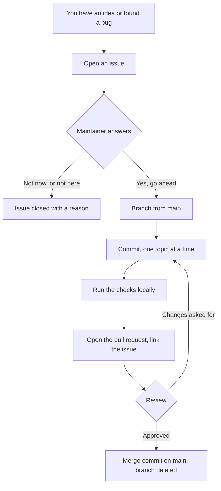

# Contributing to AbGal

AbGal is maintained by one person. That single fact explains every rule below.
There is no team to absorb a surprise, no reviewer on standby, and no budget for
untangling a change that arrived without warning. The rules are here so that
your time is not wasted, which is the only thing a small project can actually
promise a contributor.

Read this before you write code. It is shorter than the code.

## The one rule that comes before the others

**Open an issue first. Then send a pull request.**

A pull request that arrives without an issue gets closed, politely, by a
workflow, with a link back to this file. That is not rudeness and it is not
about the quality of your work. It is about the order of the conversation: a
change that nobody agreed to is a change that has to be argued about after it
was already written, and by then somebody has spent an evening on it.



The answer to an issue can be no. A no arrives within days and costs you
nothing. A no on a finished pull request arrives after you built the thing, and
that is the outcome this rule exists to prevent.

Issues are the only channel. Discussions are switched off on purpose, because a
channel nobody reads is worse than no channel at all.

## What makes an issue useful

State what you observed, what you expected, and what you ran. For a bug, the
version of the tool and the output are worth more than an adjective:

```
abgal status
python3 --version
uname -srm
```

For a feature, say what you are trying to do, not which function you want
added. The problem behind the request is often solvable in a way you did not
have in mind, and sometimes it is already solvable today.

Do not paste anything private. Log lines from a real run can carry a host name,
a user path, a serial number or an address. Read what you paste before you post
it, because an issue is public the second it exists.

## Branches

Branch from `main`. Name the branch after what it does, in English, in lower
case, words joined by a single hyphen: `contribution-rules`, `golden-image`,
`setup-command`.

**A branch carries between 300 and 1000 changed lines.**

The upper bound is the important one. Above roughly a thousand lines a review
stops being a review and turns into a rubber stamp, because nobody can hold that
much unfamiliar code in their head at once. If your change is genuinely larger,
it is genuinely several changes, and it gets several issues and several
branches.

The lower bound is a habit, not a law. It exists because a branch of forty lines
usually means the surrounding work was left for somebody else. **Never write
text or code you do not need in order to reach it.** A change that is complete
at two hundred lines is complete. Padding a branch to hit a number is worse than
missing the number, and it will be asked about in review.

## Commits

**One topic per commit.** A commit that renames a file and also fixes a bug
cannot be reverted without losing one of the two.

The subject line is `type(scope): subject`, and the scope is never omitted:

```
docs(contributing): write down the rules for issues and branches
fix(start): keep the previous emulator log
feat(cli): accept more than one guest name per start
```

The type is one of `feat`, `fix`, `docs`, `ci`, `refactor`, `test`, `chore`.

After the subject comes a blank line and then a bullet list of what changed and,
where it is not obvious, why. Not a paragraph of prose. Somebody reading
`git log` a year from now wants the facts in a shape they can skim.

**Stage by filename.** Write out the paths you mean:

```
git add CONTRIBUTING.md
```

Not `git add -A`, not `git add .`. Those two commands are how an editor backup
file, a local configuration or a stray log ends up in a public repository. The
privacy gate catches a lot of that, but it cannot catch a file whose contents
are merely embarrassing rather than private.

Prefer several small commits over one large one. A reviewer who can follow your
steps can approve them. A reviewer facing one commit of seven hundred lines can
only trust or reject it.

## Test before you commit

**Run the thing the way a user runs it, not the way you wrote it.**

This is the rule that has cost this project the most and taught it the most. A
change proved correct through a second entry point, a helper script, a copied
command line, a function called directly, is not proved at all. The path the
tool actually takes is the only path that counts.

> A change counts as done when the path the usage really takes has been tested.
> A second entry point is a quiet lie.

Concretely: if you touch `abgal start`, run `abgal start` against a real guest
and watch it come up. If you touch the temperature watch, lower
`ABGAL_TEMP_STOP` below the current temperature and watch it stop a guest. Say in the pull request what you ran and what came back.

## Everything visible on GitHub is English

Code, comments, file names, variable names, branch names, commit subjects, pull
request titles and bodies, issue titles, label names. All English.

This is not a style preference. Half of this project's local notes are in
German, and the boundary between what stays local and what becomes public has to
be a line somebody can check, not a judgement somebody has to make while tired.
The line is: if GitHub can display it, it is English.

## Nothing private, ever

The repository carries a gate:

```
python3 tools/check-private.py            # what a commit would record
python3 tools/check-private.py --all      # every tracked file
python3 tools/check-private.py --tree     # every file on disk
```

It reads what git is about to record rather than what happens to lie in the
working tree, because only the first of those ever reaches a remote. It reports
how often a pattern matched and in which file, and never the matched value, so
its own output stays safe to paste into an issue.

**Switch it on once after cloning:**

```
git config core.hooksPath .githooks
```

That single command makes the gate run before every commit. It is not on by
default, because git refuses to let a repository activate its own hooks, and for
good reason. Until you run it, nothing is checking you.

Exit code 0 means clean, and nothing else is a pass. A finding ends with 1, and
a scan that could not run ends with 2. If the gate reports something in a file
you are adding, do not work around the gate. Either the file does not belong in
the repository, or the pattern list needs a real discussion in an issue.

Patterns describing a shape, an address, a phone number, a private IP, live in
the script and are safe to publish. Literal words that must never appear live in
`.private-words`, which is not tracked. Copy `.private-words.example` and fill in
your own.

## Comments in code

Welcome where they are needed, and not elsewhere. Two to three sentences at
most.

A comment earns its place by saying **why**, especially where the code looks
wrong and is not. A comment that restates the line above it is noise that has to
be maintained. The reasoning behind a design belongs in the issue that produced
it, where it can be read in full.

## Diagrams in documentation

Where a document describes a sequence, a state or a decision, draw it as a
Mermaid block rather than describing it in prose. GitHub renders Mermaid without
an image file, which means the diagram stays in the pull request diff and can be
reviewed like text.

A flow that depends on waiting, polling, or more than one actor at the same
time is the exception, and so is a diagram that shares a page with one of
those: matching the same generated look across every diagram on a page, even
a static one with nothing to animate, keeps the page consistent instead of
switching styles mid-document. Either way, the SVG is generated by a script
under `tools/`, not drawn by hand, so the source stays reproducible and
reviewable even though nobody is expected to hand-edit it. Which one to use
follows from what the flow needs to show, or the page it sits beside, not
from habit.

## The pull request itself

Link the issue in the body, so that closing one closes the other:

```
Closes #9
```

Say what you changed, what you ran to test it, and what you deliberately left
out. The last of those three is the one people skip and the one a reviewer needs
most.

The pull request is reviewed against three questions: does it do what its body
claims, does it follow the rules on this page, and does the privacy gate pass.
Those are the same three questions every time, and they are the only ones.

### How a merge happens here

There is exactly one merge button, `Create a merge commit`. Squash and rebase
are switched off deliberately, so the individual commits of a branch survive on
`main` and the history keeps the steps you took. A merged branch is deleted
automatically. Nothing is expected of you here, but it explains why nobody will
ever ask you to squash.

## Licence

AbGal is Apache 2.0. By sending a pull request you agree that your contribution
is licensed the same way. There is no separate agreement to sign and none will
be asked for.

## If something here is wrong

These rules were written by the person who also wrote the code, which is exactly
the situation in which blind spots survive. If a rule makes no sense, or
contradicts what the repository actually does, that is a bug in this file.

Open an issue.
