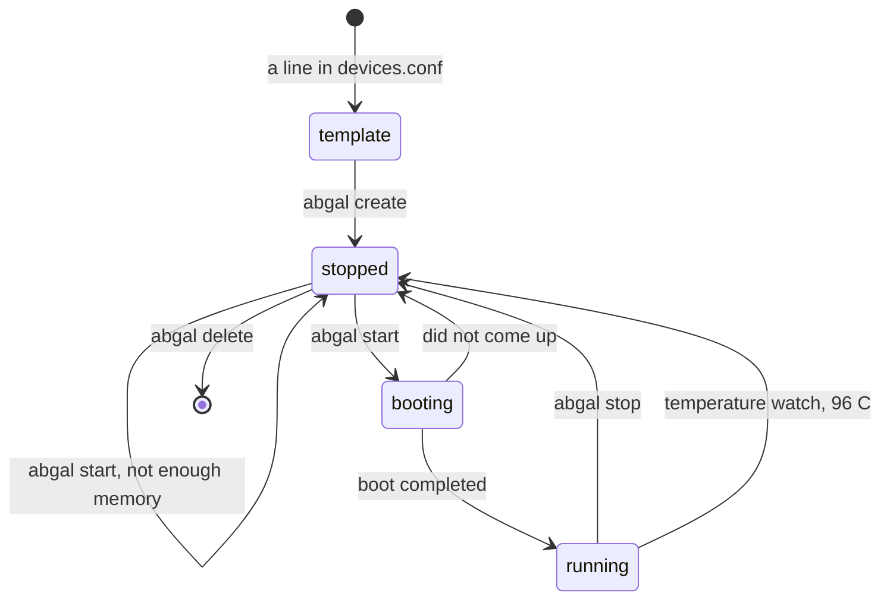

# AbGal

**Android Batch Guests, Accelerated and Local.** AbGal creates Android emulators
from a short list of templates and runs several of them side by side on one
Linux machine, without Docker and without Android Studio. It checks memory
before every start and stops a guest before the processor overheats.

A *template* describes a class of device: screen, density, Android version,
system image and memory. A *guest* is one emulator made from a template, with
its own name and its own disk. Ten guests from one template share one system
image.

## Lifecycle



`abgal start` refuses a guest before booting it when the free memory would
drop below what the machine keeps for itself. A guest keeps growing for minutes after it has
booted, so the check counts its settled size, not the size at boot. `--force`
starts it anyway.

## Quick start

AbGal runs on **Linux on x86_64 with KVM**. macOS and Windows are planned in
[#13](https://github.com/mohamadmussa/abgal/issues/13). You need Python 3, tested
with 3.11. AbGal itself uses only the Python standard library.

**1. Clone and allow KVM.**

```bash
git clone https://github.com/mohamadmussa/abgal.git
cd abgal
sudo usermod -aG kvm "$USER"
```

A session that was open before the `usermod` does not know the group yet.
`abgal start` notices that and starts through `sg kvm` for you.

**2. Fetch the Android SDK into `sdk/`.**

```bash
./abgal setup
```

`setup` names the Android SDK license and asks before it fetches anything.
`--accept-licenses` answers for a CI job. It then downloads the command line
tools named in `versions.conf`, checks their sha1, and installs the platform
tools and the emulator with the Android CLI and `--no-metrics`. Everything
lands in `sdk/`, which git ignores. The first call of the CLI puts the CLI
itself into `android-home/` in the clone, see
[What AbGal is not](#what-abgal-is-not). At the end `setup` runs
`abgal doctor`, which checks KVM, the SDK versions, the system images and the
memory and says how to fix each line that is not ok.

The system image for a template is fetched on the first `create` that needs
it, the same way and with `--no-metrics`. On the machine AbGal is developed on,
`setup` took one and a half minutes and the first `create` almost four
(2026-09-24).

**3. Create a guest and start it.**

```bash
./abgal list
./abgal create phone-1080x2400-480-api35-x86_64 --as dev
./abgal start -n dev
./abgal status
```

On the machine AbGal is developed on, the start took 50 seconds until the guest
was ready (2026-09-23). `status` then shows the process and the serial:

```text
GUEST                  ID        STATE       SERIAL         ADB          TEMPLATE
dev                    19c95791  pid 2713569 emulator-5554  device       phone-1080x2400-480-api35-x86_64

Memory available: 9211 MB. A guest needs its own size plus about 900 MB.
```

From there it is an ordinary emulator:

```bash
sdk/platform-tools/adb -s emulator-5554 install app.apk
```

**4. Stop it again.**

```bash
./abgal stop -n dev
```

## Commands

Run from the clone as `./abgal`, or put the clone on your `PATH`.

| Command | What it does |
|---|---|
| `abgal setup` | Fetches the SDK parts in `versions.conf` into `sdk/`, after asking about the license |
| `abgal doctor` | Checks KVM, the SDK versions, the system images and the memory, and names a fix for each problem |
| `abgal list` | Shows the templates in `devices.conf` and the guests on disk |
| `abgal create <template>` | Creates one guest, named after the template |
| `abgal create <template> --as ci --count 4` | Creates `ci-01` to `ci-04` |
| `abgal create <template> --as dev --recreate` | Deletes `dev` first, then creates it again. Asks first, `--yes` skips the question |
| `abgal start -n <guest>` | Starts one guest and waits until it has booted |
| `abgal start -n a -n b -n c` | Starts several, one after another, each with its own memory check |
| `abgal start -n <guest> --locale ar-SA --timezone Asia/Riyadh` | Sets language and time zone. Without them a guest gets `en-US` and `Europe/Berlin`, not the values of the machine |
| `abgal start -n <guest> --gpu host` | Renders on the graphics card instead of in software |
| `abgal start -n <guest> --wipe` | Boots as if new, user data is wiped |
| `abgal start -n <guest> --dry-run` | Shows the command line and the checks, starts nothing |
| `abgal status` | What is on disk, what is running, and how much memory is left |
| `abgal stop -n <guest>` | Stops a guest, orderly first, by signal after `--grace` seconds |
| `abgal delete -n <guest>` | Deletes a guest and its disk, after asking |
| `abgal watch -n <guest>` | The temperature watch. `start` runs it by itself, so it is only called by hand after `--no-watch` |

Every command takes `--help`. A guest can be named by its name or by its
eight character id. The [guide](docs/README.md) covers templates, the inner
workings and every error message.

### Templates

`devices.conf` holds one line per template, `devices.xml` describes the
screens. Two templates ship with AbGal, both a phone screen of 1080 x 2400 at
480 dpi on Android 15 (API 35). The comment at the top of `devices.conf` says
what each column means and how to add a template.

### How many guests fit

The `ram` column decides it. Measured on 2026-09-23 on a machine with 16 GB:
a guest of 1536 MB settles at about 2400 MB, and four of them fit at once. A
guest of 2048 MB settles at about 2900 MB, and three fit. Below 1536 MB the
guest swaps and an app takes twice as long to start.

## What AbGal is not

- **Not a container.** Guests run as plain processes on the host. There is
  no image to build and no Docker daemon.
- **Not a device farm.** There is no web interface and no remote access.
  Watching a guest from a browser is planned in
  [#20](https://github.com/mohamadmussa/abgal/issues/20).
- **Not a test runner.** AbGal gets guests ready. Maestro, Espresso, Appium or
  plain `adb` then do the testing.
- **Not for physical devices.** It creates and runs emulators only.
- **Not completely self contained yet.** SDK, guests, logs and the SDK
  tools' own user files live in the clone, most of it in `android-home/`:
  the Android CLI, about 250 MB with its own Java runtime, `devices.xml` as
  a link, and the rest of its state. Two things stay in your home folder,
  written by two different tools: adb's own files in `~/.android/`
  (`adbkey`, `adbkey.pub` and one `adb.<port>`), because adb reads no
  variable for its folder, and `~/.emulator_console_auth_token`, written by
  the emulator. A new key there would make a phone on USB ask again to
  allow the computer.

## Why it exists next to what is already there

| Project | What it does | Where AbGal differs |
|---|---|---|
| [budtmo/docker-android](https://github.com/budtmo/docker-android) | One emulator per Docker container, with a browser view through noVNC | Needs Docker. AbGal runs several guests on the host and checks memory between starts |
| [google/android-emulator-container-scripts](https://github.com/google/android-emulator-container-scripts) | Scripts to package the emulator into a container image | Container only. AbGal needs no image and no build step |
| [DeviceFarmer/stf](https://github.com/DeviceFarmer/stf) | Controls devices that are already connected, from a browser | STF starts no emulator. AbGal starts them and could sit underneath STF |
| Android Studio Device Manager | Creates and starts emulators by hand | One at a time, in a desktop program. AbGal does it in batches from a shell |
| `avdmanager` and `emulator` | The SDK tools themselves | AbGal calls them. It adds templates, batches, the memory check and the temperature watch, and pins the values `avdmanager` silently drops |

If you want one emulator in a container, use docker-android. If you want a
device lab in a browser, use STF. AbGal is for the case in between: a single
Linux machine, several emulators at once, reproducible from a text file.

## Status

AbGal is young and used daily on one machine. The open work is in
[the issues](https://github.com/mohamadmussa/abgal/issues).

## Contributing

Open an issue first, then a pull request. [CONTRIBUTING.md](CONTRIBUTING.md)
has the house rules.

## Licence

[Apache 2.0](LICENSE). Copyright 2026 Mohamad Mussa.
