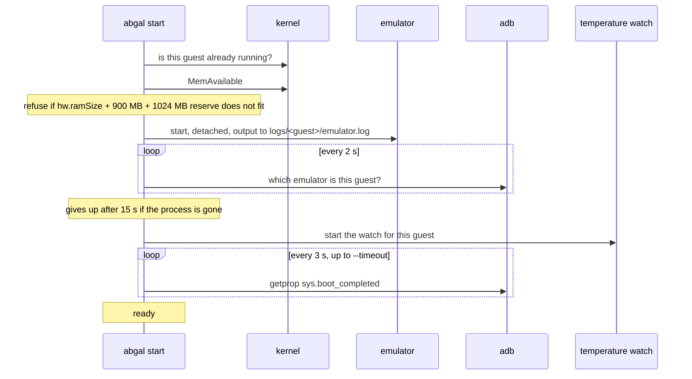
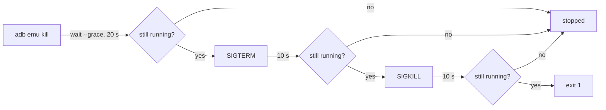
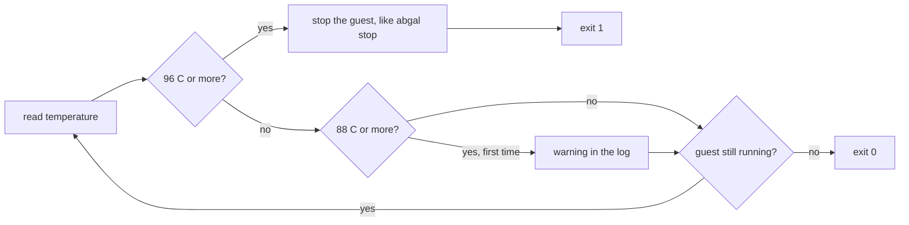

# Wie es funktioniert

Diese Seite begleitet ein Android Virtual Device (AVD) von der Zeile in
`devices.conf` bis zum gestoppten Prozess und nennt für jeden Schritt die Datei
oder Funktion, die ihn macht. Lies sie, wenn ein Befehl etwas getan hat, das du
nicht erwartet hast.

## Die Teile

| Teil | Was es ist | Was es tut |
|---|---|---|
| `abgal` | Eine Python Datei, nur Standardbibliothek | Jeder Befehl. Legt AVDs an, startet und stoppt sie, prüft den Speicher, bewacht die Temperatur |
| `bin/env.sh` | Bash, per source geladen | Die SDK Pfade für eine eigene Shell. `abgal` braucht sie nicht |
| `devices.conf` | Text, eine Zeile je Vorlage | Woraus ein AVD gemacht wird |
| `devices.xml` | XML | Die Bildschirme, auf die sich die Vorlagen beziehen |
| `versions.conf` | Text, eine Zeile je Teil des SDK | Was `setup` holt und die älteste Revision, die `doctor` gelten lässt |

## Wo alles liegt

Alles, was AbGal schreibt, landet im Klon. Im Home Ordner bleiben nur die
eigenen Dateien von adb und der Token für die Konsole:

```text
abgal/
  sdk/                    the Android SDK, ignored by git
  android-home/           user files of the SDK tools, ignored by git
  avd/
    dev.avd/
      config.ini          written by avdmanager, rewritten by every start
      abgal-template      the template this guest came from
      abgal-id            the id of this guest
    dev.ini
  logs/
    dev/
      emulator.log        this start, emulator.log.1 is the one before
      watch.log           this watch, watch.log.1 is the one before
```

`abgal` findet den Klon über seinen eigenen Pfad, deshalb funktioniert ein Klon,
wo immer er liegt. Es setzt `ANDROID_HOME`, `ANDROID_SDK_ROOT`,
`ANDROID_AVD_HOME`, `ANDROID_USER_HOME` und `ANDROID_EMULATOR_HOME` für jedes
Werkzeug, das es aufruft. Nur der Emulator liest `ANDROID_EMULATOR_HOME`, und
adb liest keine der beiden und behält seine eigenen Dateien in
`~/.android/`, siehe
[Fehlerbehebung](troubleshooting.md#files-in-your-home-folder).

## Setup und doctor

`abgal setup` liest `versions.conf` und holt nur die Teile, die noch nicht unter
`sdk/` liegen. Vor dem ersten Download nennt es die Lizenz des Android SDK und
fragt, außer mit `--accept-licenses`. Ein Zip wird neben seinem Ziel geladen,
gegen seine sha1 geprüft, mit den Rechtebits entpackt und erst dann an seinen
Platz umbenannt. Ein abgebrochenes Setup hinterlässt also keinen halben Teil.
Platform Tools und Emulator kommen über die Android CLI, und als Beleg zählt nur
ihr Ordner, aus demselben Grund wie bei [Create](#create). Ein Teil, der älter
ist als sein Minimum, wird genannt und bleibt unangetastet. Am Ende ruft
`setup` `doctor` auf, aber sein Rückgabewert sagt nur, ob das Holen geklappt
hat. Ein CI Läufer ohne `/dev/kvm` kann das SDK also trotzdem holen.

`abgal doctor` gibt je Prüfung eine Zeile aus, mit einem von sechs Zuständen:

| Zustand | Bedeutung |
|---|---|
| `ok` | nichts zu tun |
| `later` | ein Systemabbild, das das erste `create` selbst holt |
| `missing`, `too old`, `too low`, `no` | ein Problem, mit einer Abhilfe in der Zeile darunter, wo es eine gibt |

Es endet mit Rückgabewert 1, wenn eine Zeile ein Problem ist, und ruft selbst nie
`sudo` auf.

## Create

`abgal create <template> --as dev` liest die Zeile der Vorlage aus
`devices.conf` und verlinkt `android-home/devices.xml` auf die Datei im Klon,
außer die Datei gibt es schon. Mit `--recreate` fragt es zuerst einmal und
nennt dabei jedes vorhandene AVD, das gelöscht würde. Ohne Terminal lehnt es
ab, außer `--yes` ist gesetzt. Dann geht es diese Schritte einmal je AVD:

1. lehnt einen Namen mit anderem als Buchstaben, Ziffern, Punkt, Unterstrich
   und Bindestrich ab
2. prüft, dass `avdmanager list device` den Bildschirm listet
3. holt das Systemabbild mit `android --no-metrics sdk install`, wenn
   `sdk/system-images/` es nicht hat
4. lehnt ein laufendes AVD ab, weil der Emulator `config.ini` bei jedem
   Start neu schreibt
5. löscht das AVD mit `--recreate` zuerst. Ohne den Schalter behält ein
   vorhandenes AVD seine Platte und durchläuft nur die Schritte ab 7
6. legt `avd/` an und ruft `avdmanager create avd` auf
7. schreibt `abgal-template` neben `config.ini`
8. setzt fünf Werte in `config.ini` fest, einen sechsten für die Store Vorlage
9. liest `config.ini` zurück und vergleicht dreizehn Werte mit dem Verlangten

Schritt 9 ist der Grund, warum `create` mehr tut als `avdmanager` aufzurufen.
Dieses Werkzeug lässt mehrere Werte ohne Meldung fallen oder überschreibt sie,
deshalb gilt ein AVD erst als angelegt, wenn jeder Wert dem der Vorlage
entspricht. [Vorlagen](templates.md) listet die Werte.

Schritt 6 legt den Ordner zuerst an, weil `avdmanager` das AVD wortlos nach
`android-home/avd` schreibt, wenn `ANDROID_AVD_HOME` auf einen Ordner zeigt, den
es noch nicht gibt. Schritt 3 traut dem Ordner und nicht dem Exit Code, weil die
Android CLI auch bei einem Paket, das sie nicht kennt, mit 0 endet.

## Kennungen

Ein AVD bekommt eine Kennung aus acht Hexzeichen, sobald es zum ersten Mal
etwas liest. Sie liegt in `avd/<guest>.avd/abgal-id` und ändert sich nie. Die
Datei wird exklusiv angelegt, deshalb können zwei Befehle, die im selben
Augenblick auf ein neues AVD treffen, ihm keine zwei Kennungen geben.

Jeder Befehl mit `-n` nimmt den Namen oder die Kennung. Ein Name kann nach
einem Löschen wieder vergeben werden, eine Kennung nicht. Ein Skript, das genau
ein AVD treffen muss, kann also die Kennung nehmen.

## Start

`abgal start` baut den Emulator Befehl selbst. Für jedes AVD, das mit `-n`
genannt ist, eines nach dem anderen:



Der Emulator startet immer mit diesen Schaltern:

| Schalter | Warum |
|---|---|
| `-no-window`, `-no-audio`, `-no-boot-anim` | Ein AVD läuft ohne Bildschirm und ohne Soundkarte |
| `-no-metrics` | Ohne ihn fragt der Emulator nach Nutzungsdaten, und eine spätere Version soll anhalten und auf die Antwort warten |
| `-gpu software` | Rechnet auf dem Prozessor, das geht auf jedem Rechner. `--gpu host` oder `ABGAL_GPU` ändert es |
| `-lowram` | Siehe [Speicher](#memory) |
| `-no-snapshot-load`, `-no-snapshot-save` | Jeder Start ist ein Kaltstart, damit kein Lauf vom vorigen abhängt |
| `-prop persist.sys.locale=en-US` | Sprache, aus `--locale` oder `ABGAL_LOCALE` |
| `-prop persist.sys.timezone=Europe/Berlin` | Zeitzone, aus `--timezone` |

`--wipe` ergänzt `-wipe-data`, `--port` ergänzt `-port`.

`--dry-run` gibt diese Befehlszeile aus und dazu, was jede Prüfung sagen würde:
ob das AVD schon läuft, ob der Speicher reicht, ob sein `hw.ramSize` von der
Vorlage abweicht und ob die Temperaturwache messen kann. Es startet nichts und
legt den Ordner der Logs nicht an. Es endet mit Exitcode 1, wenn irgendeine
Prüfung, für irgendein AVD, einen echten Start abgelehnt hätte, und mit 0,
wenn jedes AVD gestartet wäre.

Hat die Sitzung die Gruppe `kvm` noch nicht, läuft der ganze Befehl über
`sg kvm -c`, und `start` sagt das.

### Speicher

Ohne `-lowram` übergeht der Emulator `hw.ramSize` und gibt jedem AVD 2560 MB.
Mit dem Schalter gilt der Wert aus der Vorlage genau, und das AVD meldet sich
trotzdem nicht als Gerät mit wenig Speicher (`ro.config.low_ram` bleibt leer).

Die Prüfung vor einem Start zählt drei Zahlen:

- `hw.ramSize` dieses AVD, aus seiner `config.ini`
- 900 MB obendrauf, vor allem für die Grafik in Software
- 1024 MB, die der Rechner für sich behält

Ein AVD wächst nach dem Booten noch minutenlang. Die Prüfung läuft für jedes
AVD eines Stapels neu, in dem Moment, in dem es an der Reihe ist. So sieht das
zweite AVD den Speicher, den das erste wirklich genommen hat. `--force`
überspringt die Prüfung.

Fehlt in `/proc/meminfo` das Feld `MemAvailable`, gibt es keine Zahl zum
Vergleichen, und `start` sagt das mit einem Hinweis, statt die Prüfung
stumm zu überspringen. Es startet das AVD trotzdem.

Ein AVD aus der Zeit vor der Speicheränderung kann noch ein altes
`hw.ramSize` tragen, das nicht zu seiner Vorlage passt, und `-lowram`
lässt diesen gespeicherten Wert gelten. `start` vergleicht die beiden
Werte und nennt bei einem Unterschied `abgal create <template> --as
<guest>` als Abhilfe, die die Platte behält und nur die Werte
aktualisiert. Es startet das AVD in beiden Fällen mit dem Wert, der
schon auf der Platte steht.

### Ports

Ohne `--port` sucht der Emulator ab 5554 in Zweierschritten aufwärts und nimmt
selbst das erste freie Paar. Die gerade Zahl ist die Konsole, die ungerade
danach ist adb. `abgal` fragt danach jeden Emulator über seine Konsole, welches
AVD er fährt, und muss den Port deshalb nicht vorher kennen.

`--port` nimmt eine gerade Zahl von 5554 bis 5584 und genau ein AVD.

## Stop

`abgal stop -n dev` geht drei Schritte und hört beim ersten auf, der wirkt:



Ein hartes Beenden kann die Platte des AVD beschädigen, deshalb ist es der
letzte Schritt. Lebt der Prozess selbst danach noch, sagt `stop` das und endet
mit Exit Code 1. Mehrere AVDs werden nacheinander gestoppt. Der Befehl gibt den
danach freien Speicher aus, weil der entscheidet, ob das nächste AVD starten
darf.

`start` und `stop` kennen kein "alle". Ohne `-n` geben sie ihre Hilfe aus und
enden mit Exit Code 1. So scheitert `abgal stop -n "$GUEST"` mit einer leeren
Variable, statt alles zu stoppen.

## Temperaturwache

`abgal start` startet neben jedem AVD `abgal watch -n <guest>`, sobald seine
Konsole antwortet. Die Wache liest alle zwei Sekunden die Temperatur des
Prozessorpakets, aus der Zone `x86_pkg_temp` unter `/sys/class/thermal`, und aus
`sensors`, wenn diese Zone fehlt.



Der Chip selbst meldet 84 C als hoch und 100 C als kritisch. Die Warnung liegt
über 84, weil schon der Leerlauf 86 C erreichte, ohne dass der Prozessor
bremste, und der Stopp liegt unter 100, damit die Wache vor der Hardware
handelt. Nach vier Messungen in Folge ohne Wert endet die Wache mit Exit Code 2,
statt nur so zu tun, als würde sie wachen.

Jede Zeile geht nach `logs/<guest>/watch.log`, und der vorige Lauf bleibt als
`watch.log.1`. Diese Variablen ändern die Zahlen:

| Variable | Standard | Bedeutung |
|---|---|---|
| `ABGAL_TEMP_WARN` | 88 | Warnung ab dieser Temperatur, in C |
| `ABGAL_TEMP_STOP` | 96 | Stopp ab dieser Temperatur, in C |
| `ABGAL_TEMP_INTERVAL` | 2 | Sekunden zwischen zwei Messungen |
| `ABGAL_TEMP_GRACE` | 20 | Sekunden, die ein geordneter Stopp dauern darf |
| `ABGAL_TEMP_WARMUP` | 120 | Sekunden, die auf das AVD gewartet wird |
| `ABGAL_TEMP_LOG` | `logs/<guest>/watch.log` | wohin das Protokoll geht |

Setz sie vor `abgal start`, und die Wache, die es startet, erbt sie. Um den
Stopp zu sehen, ohne den Rechner zu heizen, setz `ABGAL_TEMP_STOP` unter die
aktuelle Temperatur.

`start` liest diese Werte, bevor das erste AVD startet, und lehnt einen ab, der
keine ganze Zahl ist. Es misst außerdem selbst einmal die Temperatur und startet
kein AVD, wenn es keinen Wert bekommt. Zwei Sekunden nach dem Start einer
Wache prüft es, ob sie noch lebt. Lebt sie nicht, sagt `start` das, startet
kein weiteres AVD des Stapels und endet mit Exit Code 1. Das AVD läuft ohne
Wache weiter.
