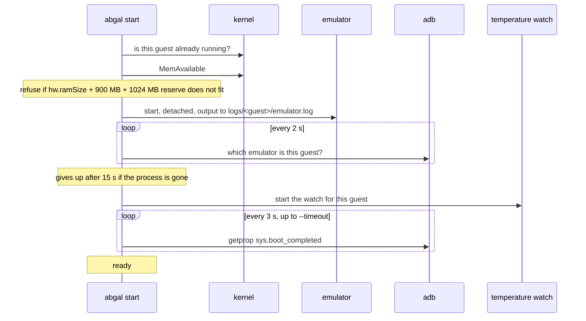
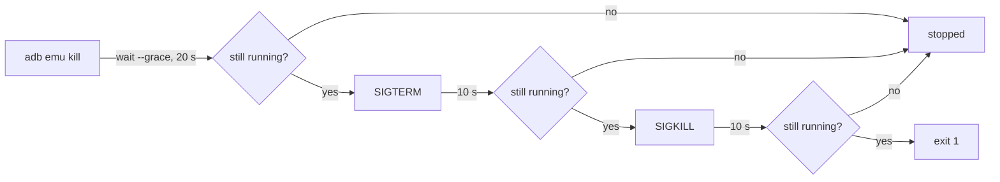
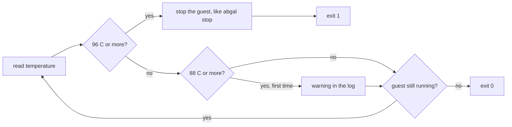

# How it works

This page follows one guest from the line in `devices.conf` to a stopped
process, and names the file or function that does each step. Read it when a
command did something you did not expect.

## The pieces

| Piece | What it is | What it does |
|---|---|---|
| `abgal` | One Python file, standard library only | Every command. Creates guests, starts and stops them, checks memory, watches the temperature |
| `bin/env.sh` | Bash, sourced | The SDK paths for a shell of your own. `abgal` does not need it |
| `devices.conf` | Text, one line per template | What a guest is made from |
| `devices.xml` | XML | The screens the templates refer to |
| `versions.conf` | Text, one line per SDK part | What `setup` fetches and the oldest revision `doctor` accepts |

## Where things live

Everything AbGal writes lands inside the clone, apart from one link in the
home folder, `~/.android/devices.xml`:

```text
abgal/
  sdk/                    the Android SDK, ignored by git
  avd/
    dev.avd/
      config.ini          written by avdmanager, rewritten by every start
      abgal-template      the template this guest came from
      abgal-id            the id of this guest
    dev.ini
  logs/
    dev/
      emulator.log        this start, emulator.log.1 is the one before
      watch.log           this watch, watch.log.1 is the one before
```

`abgal` finds the clone from its own path, so a clone works wherever it is
put. It sets `ANDROID_HOME`, `ANDROID_SDK_ROOT` and `ANDROID_AVD_HOME` for
every tool it calls. The SDK tools still keep files in `~/.android/`, the
Android CLI among them, see [Troubleshooting](troubleshooting.md#files-in-your-home-folder).

## Setup and doctor

`abgal setup` reads `versions.conf` and fetches only the parts that are not
under `sdk/` yet. Before the first download it names the Android SDK license
and asks, unless `--accept-licenses` is given. A zip is downloaded next to its
target, checked against its sha1, unpacked with the permission bits kept, and
only then renamed into place, so an interrupted setup leaves no half part.
The platform tools and the emulator come from the Android CLI, and only their
folders count as proof, for the same reason as in [Create](#create). A part
older than its minimum is named and left alone. `setup` ends by running
`doctor`, but its exit code only says whether fetching worked, so a CI runner
without `/dev/kvm` can still fetch the SDK.

`abgal doctor` prints one line per check, with one of six states:

| State | Meaning |
|---|---|
| `ok` | nothing to do |
| `later` | a system image that the first `create` fetches by itself |
| `missing`, `too old`, `too low`, `no` | a problem, with a fix on the next line where there is one |

It ends with exit code 1 when a line is a problem, and never runs `sudo`
itself.

## Create

`abgal create <template> --as dev` reads the template line from
`devices.conf` and links `~/.android/devices.xml` to the file in the clone,
unless that file already exists. Then it takes these steps once per guest:

1. refuses a name with anything but letters, digits, dot, underscore and dash
2. checks that the screen is listed by `avdmanager list device`
3. fetches the system image with `android --no-metrics sdk install` if
   `sdk/system-images/` does not have it
4. refuses a guest that is running, because the emulator rewrites
   `config.ini` at every start
5. deletes the guest first with `--recreate`. Without it, a guest that exists
   keeps its disk and only gets the steps from 7 on
6. creates `avd/` and calls `avdmanager create avd`
7. writes `abgal-template` next to `config.ini`
8. pins five values in `config.ini`, and a sixth for the store template
9. reads `config.ini` back and compares thirteen values with what it asked for

Step 9 is why `create` does more than call `avdmanager`. That tool drops or
overrides several values without a message, so a guest is only reported as
created when every value is what the template says. [Templates](templates.md)
lists the values.

Step 6 creates the folder first because `avdmanager` writes the guest to
`~/.android/avd` without a word when `ANDROID_AVD_HOME` points at a folder
that does not exist yet. Step 3 trusts the folder and not the exit code,
because the Android CLI ends with 0 even for a package it does not know.

## Ids

A guest gets an id of eight hex characters the first time anything reads it.
It is stored in `avd/<guest>.avd/abgal-id` and never changes. The file is
created exclusively, so two commands meeting a new guest at the same moment
cannot give it two ids.

Every command that takes `-n` accepts the name or the id. A name can be
reused after a delete, an id cannot, so a script that must hit exactly one
guest can use the id.

## Start

`abgal start` builds the emulator command itself. For each guest named with
`-n`, one after another:



The emulator is always started with these flags:

| Flag | Why |
|---|---|
| `-no-window`, `-no-audio`, `-no-boot-anim` | A guest runs without a screen or sound card |
| `-no-metrics` | Without it the emulator asks about usage data, and a later version is to stop and wait for the answer |
| `-gpu software` | Renders on the processor, which works on every machine. `--gpu host` or `ABGAL_GPU` changes it |
| `-lowram` | See [Memory](#memory) |
| `-no-snapshot-load`, `-no-snapshot-save` | Every start is a cold boot, so no run depends on the one before |
| `-prop persist.sys.locale=en-US` | Language, from `--locale` or `ABGAL_LOCALE` |
| `-prop persist.sys.timezone=Europe/Berlin` | Time zone, from `--timezone` |

`--wipe` adds `-wipe-data`, `--port` adds `-port`.

If the session does not have the `kvm` group yet, the whole command runs
through `sg kvm -c`, and `start` says so.

### Memory

Without `-lowram` the emulator ignores `hw.ramSize` and gives every guest
2560 MB. With it, the value from the template is used exactly, and the
guest still does not report itself as a low memory device
(`ro.config.low_ram` stays empty).

The check before a start counts three numbers:

- `hw.ramSize` of this guest, from its `config.ini`
- 900 MB on top, mostly the software renderer
- 1024 MB that the machine keeps for itself

A guest keeps growing for minutes after it has booted. The check is done
again for each guest of a batch, at the moment it is its turn, so the second
guest sees the memory the first one really took. `--force` skips the check.

### Ports

Without `--port` the emulator searches upwards from 5554 in steps of two and
takes the first free pair itself. The even number is the console, the odd
one after it is adb. `abgal` then asks each emulator on its console which
guest it runs, so it does not need to know the port in advance.

`--port` takes an even number from 5554 to 5584 and exactly one guest.

## Stop

`abgal stop -n dev` takes three steps and stops at the first that works:



A hard kill can damage the guest's disk, so it is the last step. If even that
leaves the process alive, `stop` says so and ends with exit code 1. Several
guests are stopped one after another. The command prints the memory that is
free afterwards, because that decides whether the next guest may start.

`start` and `stop` have no "all". Without `-n` they print their help and end
with exit code 1, so `abgal stop -n "$GUEST"` with an empty variable fails
instead of stopping everything.

## Temperature watch

`abgal start` starts `abgal watch -n <guest>` next to each guest, once its
console answers. The watch reads the processor package temperature every two
seconds, from the `x86_pkg_temp` zone under `/sys/class/thermal`, and from
`sensors` if that zone is missing.



The chip itself reports 84 C as high and 100 C as critical. The warning sits
above 84, because idle already reached 86 C without the processor slowing
down, and the stop sits below 100, so the watch acts before the hardware
does. After four readings in a row without a value, the watch ends with exit
code 2 rather than pretend to watch.

Every line goes to `logs/<guest>/watch.log`, and the previous run is kept as
`watch.log.1`. These variables change the numbers:

| Variable | Default | Meaning |
|---|---|---|
| `ABGAL_TEMP_WARN` | 88 | warning from this temperature, in C |
| `ABGAL_TEMP_STOP` | 96 | stop from this temperature, in C |
| `ABGAL_TEMP_INTERVAL` | 2 | seconds between readings |
| `ABGAL_TEMP_GRACE` | 20 | seconds an orderly stop may take |
| `ABGAL_TEMP_WARMUP` | 120 | seconds to wait for the guest to appear |
| `ABGAL_TEMP_LOG` | `logs/<guest>/watch.log` | where the log goes |

Set them in front of `abgal start`, and the watch it starts inherits them.
To see the stop work without heating the machine, set `ABGAL_TEMP_STOP` below
the current temperature.

`start` reads these values before the first guest starts and refuses one that
is not a whole number. It also takes one temperature reading itself and starts
no guest if there is none. Two seconds after starting a watch it checks that
the watch is still alive. If it is not, `start` says so, starts no further
guest of the batch, and ends with exit code 1. The guest keeps running without
a watch.
